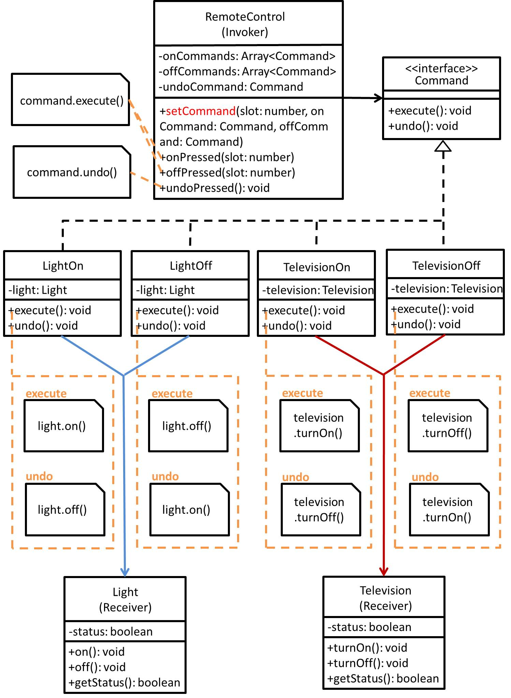

# Command - 命令模式
## 目的
將「請求」封裝為物件，從而使接收端可以依據這些「請求」使之參數化操作，甚至可以佇列(queue)這些「請求」又或者將這些「請求」記於日誌(log)中，此模式也支援復原(undo)的操作。

## 舉例
假設今天有一廠商想要做一支遙控器，但是這支**遙控器要能控制多個家電且未來要可擴充**，這時命令模式就能派上用場！

## 類別圖


## 值得注意什麼？
- 將**發出請求的物件**和**接受與執行請求的物件**分開(ex. 將**遙控器**和**家電**解耦)。
- **Command 的 execute 不一定只做一件事，也可以是做很多事的複合式命令**。
- 接收端可以某種程度的控制這些「請求」，像是是否處理這些「請求」、佇列這些「請求」待處理、重做這些「請求」...等等。
- 很容易擴充新命令，只要依據 Command 介面去實作 ConcreteCommand，而且也不影響其他類別。
### 缺點
- 如果命令太多，勢必會有很多命令類別出現，需要注意。

## 測試
```
$ npm run test Command
```

 ## 參考文章
 - [命令模式 (Command Pattern)](http://corrupt003-design-pattern.blogspot.com/2016/06/command-pattern.html)
 - [\[Day 9\] 初探設計模式 - 命令模式 ( Command Pattern )](https://ithelp.ithome.com.tw/articles/10204425)
