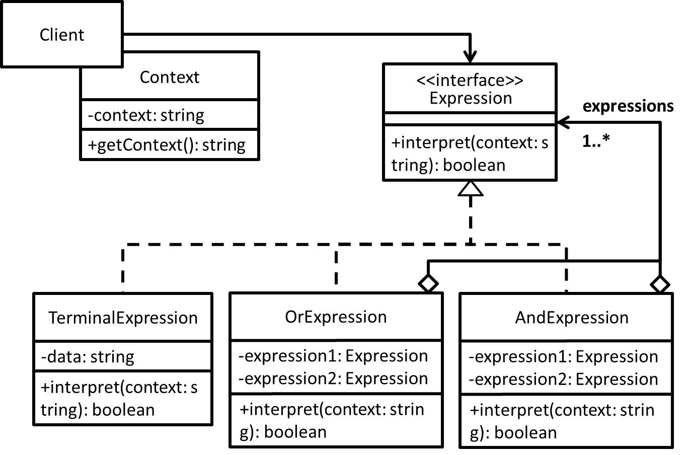

# Interpreter Method - 直譯器(解譯器)模式
## 目的
給定一種語言及其文法表現形式，透過一個解譯器來敘述該語言並展現其真正意涵。

## 舉例
透過組合表達式來解譯一段文字，來得知每個人現階段是否單身或已婚？

(補充舉例)
SQL 解析就是一種例子，比如一段 SQL 它其實就可以被視為是 Context，從中解譯出它到底是要 Query、Insert、Update、Delete ...等等。

## 類別圖


## 值得注意什麼？
- 透過"語言"來表現要解決的問題，以"語言"寫出之"程式"來表現具體的問題，而該"程式"並沒有辦法獨自運作，需透過一解譯器才能知道其真正意涵。
- 每個語法規則都設計相對應的類別且這些語法可能可以在展開(樹狀結構)。
- 當能解決的問題發生變化時，要修改"程式"來對應處理，而不是直接修改解譯器(儘量避免去修改)。
### 缺點
- 當語法規則多且複雜時，類別數量也會跟著變多。

## 延伸
巴科斯範式(BNF)：[使用巴科斯範式(BNF/EBNF)定義語言](https://hackmd.io/@ShenTengTu/HJzCM3aDr)

## 測試
```
$ npm run test Interpreter
```

## 參考文章
- [解譯器模式 (Interpreter Pattern)](http://corrupt003-design-pattern.blogspot.com/2017/01/interpreter-pattern.html)
- [Interpreter Pattern -- 以類別來表達文法規則](http://twmht.github.io/blog/posts/design-pattern/interpreter.html)