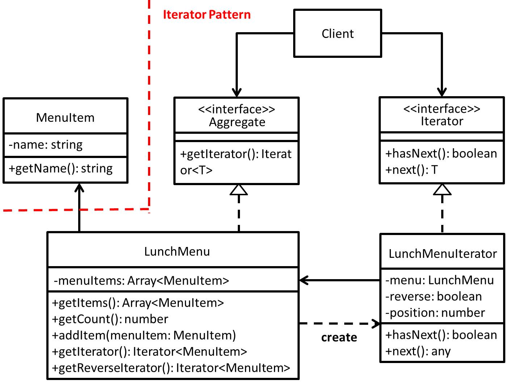

# Iterator - 反覆器模式
## 目的
提供一種方式，可以在不暴露其聚集實踐方式情況下，取得該聚集內每一元素。

## 舉例
以餐廳呈現菜單為例子，而這間餐廳在呈現菜單的實作上是用 Array 來處理，假設今天這間餐廳要和其他是利用 ArrayList 實作呈現菜單的餐廳要合併的話，這下就很尷尬了，因為如果要呈現菜單，勢必需要能夠一次處理 Array 及 ArrayList 這兩種情況，那未來如果又有其他型態的話，會造成維護上越來越困難...

## 類別圖


## 值得注意什麼？
- 著重於**封裝重複的動作**。
- **無論 ConcreteAggregate(LunchMenu)如何被實作，只要符合能正確傳出 ConcreteIterator(LunchMenuIterator)，則 Client 幾乎不用動程式碼**，因為 Client 是依據 Iterator 介面呼叫方法去使用，而不是透過 ConcreteAggregate。
- **上述是基於 Aggregate 介面不變動情況下可成立**，因為 ConcreteIterator 需要非常了解 ConcreteAggregate，才能正確取得預期的元素，所以假設 Aggregate 介面變動了，勢必 ConcreteIterator 會有一定程度的影響。
- 此模式把**如何巡訪的邏輯**已有和**使用元素的邏輯**切開(解耦)，所以以 ConcreteAggregate 來看，可以有一個以上的 ConcreteIterator。
### 缺點
- 無法動態新刪元素，任何時機點的新刪元素皆有可能破壞 Iterator 的正確性，意指一開始就需決定哪些元素需被巡訪。

## 測試
```
$ npm run test Iterator
```

 ## 參考文章
 - [反覆器模式 (Iterator Pattern)](http://corrupt003-design-pattern.blogspot.com/2016/07/iterator-pattern.html)
 - [Iterator Pattern](http://twmht.github.io/blog/posts/design-pattern/iterator.html)
 - [Iterator](https://refactoring.guru/design-patterns/iterator)
 - [\[Design Pattern\] Iterator 迭代器模式](https://ithelp.ithome.com.tw/articles/10224707) 
