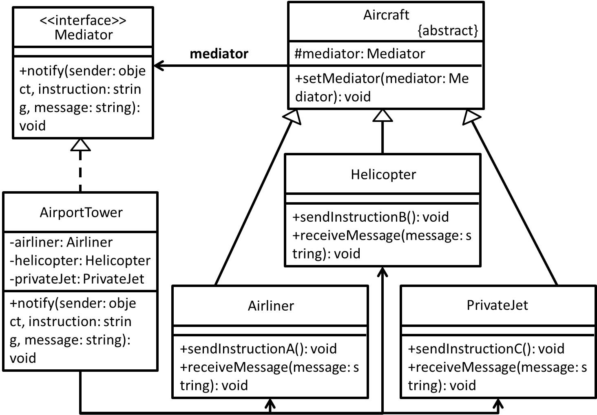

# Mediator - 中介者模式
## 目的
減少物件之間混亂的依存關係，限制物件之間的直接溝通並迫使它們僅通過中介物件進行交流，而底下物件可各自獨立發展。

## 舉例
- 現實世界的例子像是機場，**機場塔台就扮演著中介者角色**，而其它**直升機、客機、私人飛機都是要和機場塔台交流，而不會是飛機之間互相交流**，因為會造成很大的混亂...
- 若以視窗程式為例子，**協調各個元件的 Dialog 就扮演著中介者角色**，其它像是 **TextBox、Button、Label 這些元件，因為會有一些動態變化，這些變化都要通知 Dialog**，這樣 Dialog 就能從中找出一個解決方案並做出合適指示(例如打錯帳號密碼，哪邊要顯示訊息之類的...)。 

## 類別圖


## 值得注意什麼？
- 符合單一職責原則(SRP)，因為底下物件可以專注發展自己，它們之間的溝通都必須是透過中介者。
- 符合開放/封閉原則(OCP)，即便從中調換掉中介者，也不會影響底下物件各自發展。
- 依據上述幾點，可以降低底下物件之間耦合(解耦)並且可以較輕易重用這些物件。
### 缺點
- 中介者隨著時間增長，有機會變成 God object。

## 延伸
God object：反模式(Anti-pattern)的一種，意指這個物件知道太多事情或是做太多事情。

## 測試
```
$ npm run test Mediator
```

 ## 參考文章
 - [中介者模式 (Mediator Pattern)](http://corrupt003-design-pattern.blogspot.com/2017/01/mediator-pattern.html)
 - [Mediator](https://refactoring.guru/design-patterns/mediator)
 - [Mediator Pattern -- 只要面對一個顧問](http://twmht.github.io/blog/posts/design-pattern/mediator.html)
 - [God object](https://en.wikipedia.org/wiki/God_object)