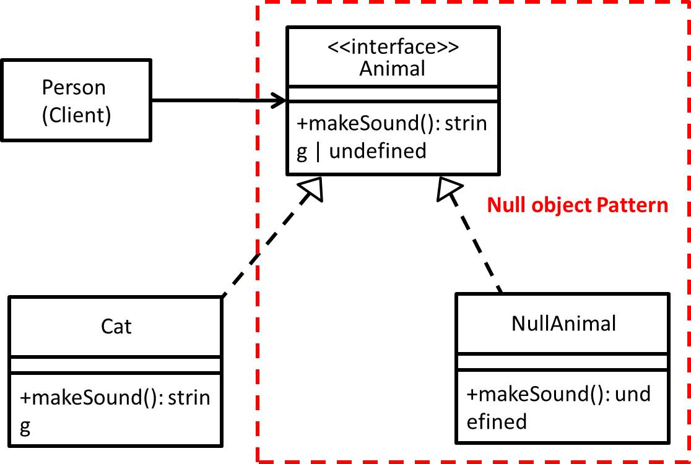

# Null object - 空物件模式
## 目的
提供一個預設的無意義物件來避免 Null 參考，簡言之就是為了減少程式出現 Null 判斷而出現的設計模式。

## 舉例
以我們人類聽到動物的叫聲為例子。

## 類別圖


## 值得注意什麼？
- 可以增加程式可讀性，因為物件現在可以承擔處理 Null 的責任，而不是由 Client 端承擔(減少撰寫 Null 判斷的次數)。
- 減少撰寫 Null 判斷的次數，意味著程式分支數量減少，相對來說執行速度就會變快。
- 減少程式分支數量，意味著單元測試案例也跟著減少，測試上容易許多。

## 測試
```
$ npm run test NullObject
```

 ## 參考文章
 - [空物件模式（Null Object Pattern）](https://www.itread01.com/content/1541649004.html)
 - [C# Null Object Pattern](https://medium.com/@mybaseball52/c-null-object-pattern-c23c9105daf9)
