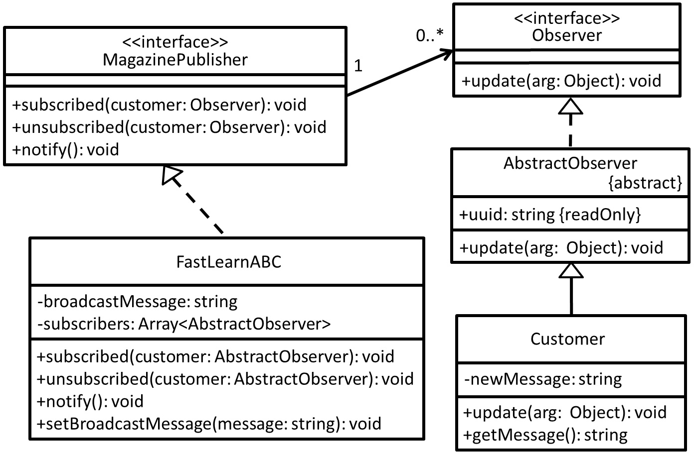

# Observer - 觀察者模式
## 目的
為了實現物件之間推播/訂閱行為，被訂閱方可以主動推播，而訂閱者則會被通知(可接受或不接受)，存在一對多依存關係，也是一種降低耦合的手段。

## 舉例
以訂閱為例子，雜誌商希望他們的客戶**時常能取得他們最新的訊息**，多會**希望客戶訂閱他們**，這樣客戶才不會遺漏最新訊息。

## 類別圖


## 值得注意什麼？
- 定義**一對多依存關係**，當雜誌商有任何變更通知，這些訂閱者**可以選擇更新或者不更新**。
- **被訂閱方和訂閱方互不影響**。
- 兩種狀況可運用
    - 由**被訂閱方告訴訂閱方我這邊狀態有更新了**，訂閱方可以自己來取多少資料回去(對訂閱方來說像是 pull 的動作)。
    - 由**被訂閱方直接傳送所有資料**(不管對方是否有興趣)，訂閱方則可以依照自己需求更新自己的資料(對被訂閱方來說像是 push 的動作)。

## 測試
```
$ npm run test Observer
```

## TODO
1. 如何由客戶這邊取得雜誌商狀態，進而由客戶這邊主動取得特定資料? => 取得雜誌商的reference，進而在客戶這邊有操作空間?
2. 如何判別特定雜誌商所傳遞的資料型別(有可能不同)? => 由客戶這邊定出一個介面，可否統一操作此介面，實作端遵守就好?

 ## 參考文章
 - [Design Pattern(2) - Observer](https://www.jyt0532.com/2017/04/12/observer/)
 - [初探設計模式 - 觀察者模式 ( Observer Pattern )](https://ithelp.ithome.com.tw/articles/10204117)
