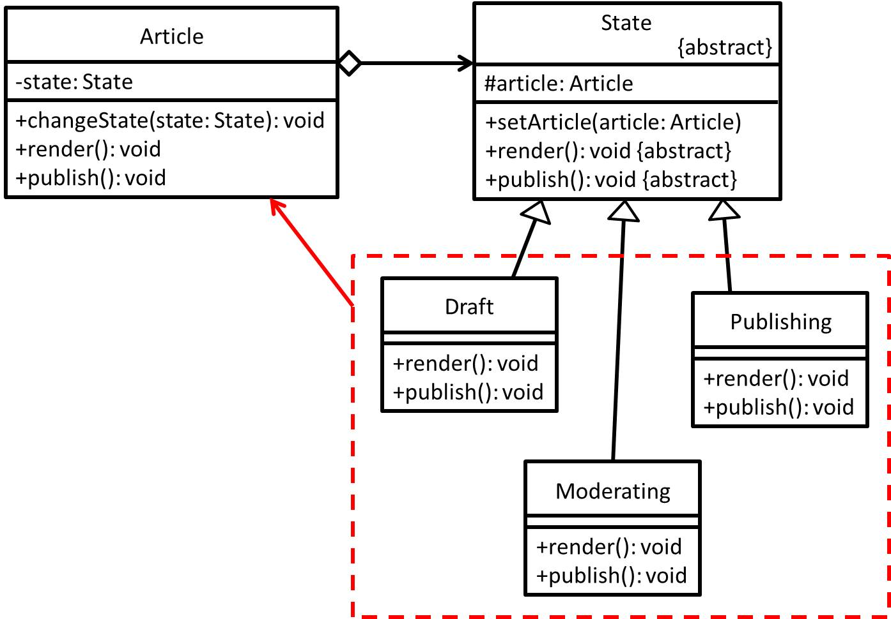

# State - 狀態模式
## 目的
允許物件隨著內部狀態改變而改變其行為，好似物件改變其類。

## 舉例
若以一篇文章為例子，它本身可能會經過草稿、審核、發佈等等這些狀態...

## 類別圖


## 值得注意什麼？
- 當物件的行為會依據其不同狀態(含有大量條件)而有不同時，而且狀態很多時，則建議使用此模式，來降低本身物件複雜度。
- 因各個狀態被抽為一類別來管理，所以相對來說很好新增及更改狀態實作，而不會影響使用狀態的物件本身。
- 第二點描述剛好符合單一職責原則(SRP)及開放/封閉原則(OCP)。
- 呼應第一點描述，可以減少含有大量條件的程式寫法，某種程度可以簡化程式結構。
### 缺點
- 如果條件不是那麼多或是本身物件不會因為條件增加而修改，反而不建議使用此模式，有點殺雞焉用牛刀。

## 測試
```
$ npm run test State
```

 ## 參考文章
 - [狀態模式 (State Pattern)](http://corrupt003-design-pattern.blogspot.com/2016/10/state-pattern.html)
 - [State](https://refactoring.guru/design-patterns/state)
