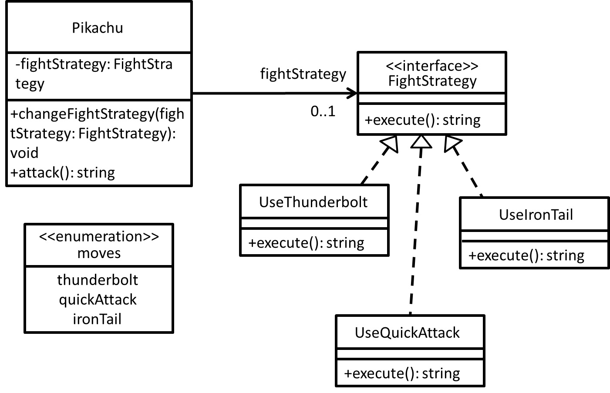

# Strategy - 策略者模式
## 目的
藉由把策略抽象化，使多個策略之間能快速替換。

## 舉例
以寶可夢對戰為例子，面對不同寶可夢的招式時，適時改變策略應對吧！

## 類別圖


## 值得注意什麼？
從類別圖看好像和 Simple Factory Pattern 很相似，但其實兩者關注的地方不一樣。
- Simple Factory Pattern 是用來建立物件的模式，關注**物件如何被產生**。
- Strategy Pattern 是一種行為模式，關注**行為的封裝**。

## 測試
```
$ npm run test Strategy
```

## 參考文章
 - [策略模式 Strategy Pattern](https://skyyen999.gitbooks.io/-study-design-pattern-in-java/content/strategy.html)
 - [策略模式與簡單工廠模式有什麼不同?](https://skyyen999.gitbooks.io/-study-design-pattern-in-java/content/strategySimpleFactory.html)
 - [Design Pattern(1) - Strategy](https://www.jyt0532.com/2017/04/07/strategy/)
