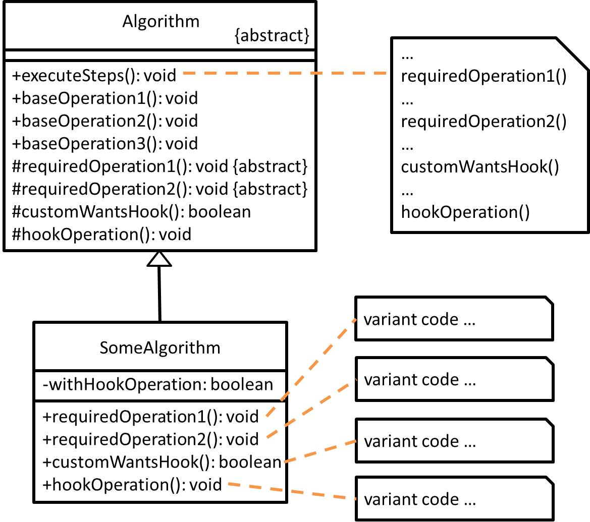

# Template Method - 樣板模式
## 目的
定義一演算法骨架於一方法中並將**某些步驟**推遲至子類別去實作，該模式讓子類別重新定義**某些步驟**，而不會改變到演算法本身結構。
(不是一定只有侷限只能用於演算法，比如飲料店有提供咖啡跟茶，兩者都有一定的 SOP，但從中可以分析出哪些步驟相同可以抽去父類別，而有差異的步驟則可以交由子類別去實作...)

## 舉例
假設我是一名研究生，正在研究某領域中之應用演算法，透過長期閱讀他人論文，得知了一些既有演算法的步驟，而我將這些既有且相同的步驟描述於演算法骨架當中並尋找某些步驟來將演算法得出之結果昇華。

## 類別圖


## 值得注意什麼？
- 有一技巧可用，就是掛鉤(Hook)，通常於父類別所描述之骨架方法中讓子類別決定要不要去多執行這一步驟，但沒有強制一定要實作掛鉤方法。
- 該模式符合「好萊塢守則」，允許低階元件自己掛鉤在系統上，但是由高階元件決定何時使用低階元件(高階元件則不會太依賴低階元件)。
- 重複的步驟可以放於父類別，減少重複程式碼區塊。
### 缺點
- 畢竟樣板模式的前提在於需要先定義好演算法骨架，若假設客戶的需求會需要調動骨架，則父類別有可能會被改變！(客戶端會被受限)
- 隨著步驟越多，則該模式會越難維護。
- 有機會違反 Liskov Substitution Principle(LSP)，於**父類別所定義的步驟行為**，若**子類別不遵循其定義之行為**去實作，將導致無法預期的情況。

## 延伸
好萊塢守則：別呼叫我們，我們會呼叫你。

## 測試
```
$ npm run test TemplateMethod
```

## 參考文章
- [樣板方法模式 (Template Method Pattern)](http://corrupt003-design-pattern.blogspot.com/2016/07/template-method-pattern.html)
- [Template Method](https://refactoring.guru/design-patterns/template-method)
- [亂談軟體設計（4）：Liskov Substitution Principle](http://teddy-chen-tw.blogspot.com/2012/01/4.html)