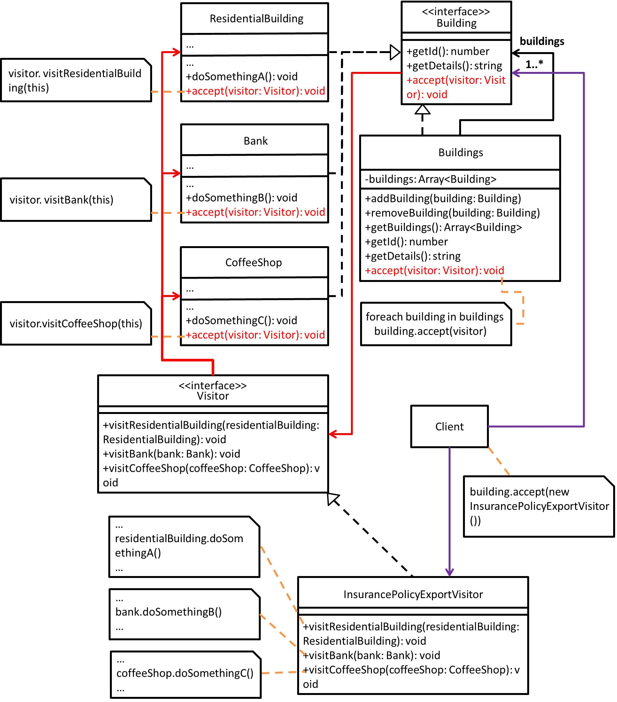

# Visitor - 訪問者模式
## 目的
意指在物件結構的元素之上執行操作(處理)，透過訪問者直接定義新操作，而不需要改變原本其所操作元素的類別。
(白話：將**物件結構本身**和**處理事情**分離，建立一個可以在物件結構內穿梭的訪問者並交給他去處理事情...)

## 舉例
以保險業務為例子，他想要增加保單數量，面對像是不同建築物...等等，勢必是要介紹不同種類的保單，才有機會拉到新客戶。(總不可能拿同一張保單幹到底...)

## 類別圖


## 值得注意什麼？
- 適用於需對多個元素(像是樹狀結構、多型陣列...)執行操作，可參考此模式。
- 透過將部分操作行為提取至訪問者類別，可以讓原本物件結構更專注於自己的行為。
- 符合開放/封閉原則(OCP)，因為新增行為只要新增訪問者類別，而不用動到物件結構本身。
- 符合單一職責原則(SRP)，如果程式語言可多載，則可以將多個同樣行為(但操作物件結構不同)放於一個訪問者類別中。
### 缺點
- 當有異動物件結構本身(新增或刪除行為)時，很可能就需要連帶將訪問者類別做更新(因為是透過訪問者來增加行為，所以有多少個訪問者，就有可能要處理多少個)。
- 以訪問者來說，被訪問的物件結構，理想上應該要能使用物件結構本身的屬性及方法，但是礙於存取層級關係，有可能不能像是操作物件結構本身那樣去大展身手。

## 測試
```
$ npm run test Visitor
```

 ## 參考文章
 - [訪問者模式 (Visitor Pattern)](http://corrupt003-design-pattern.blogspot.com/2017/02/visitor-pattern.html)
 - [Visitor](https://refactoring.guru/design-patterns/visitor)
 - [Visitor and Double Dispatch](https://refactoring.guru/design-patterns/visitor-double-dispatch)
