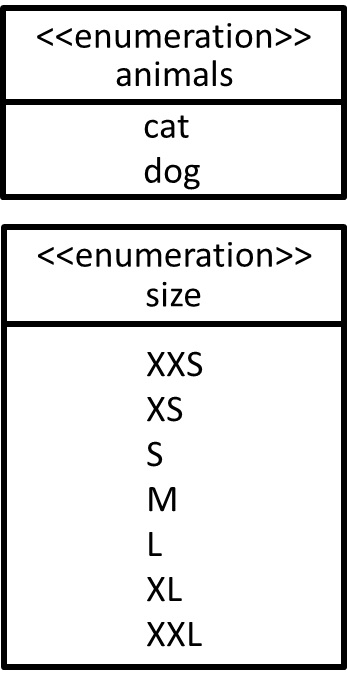

# Abstract Factory - 抽象工廠模式
## 目的
為了創造**一系列相關或相依**的物件，但不以經過它們具體類別去生成的情況下去完成這件事(站在使用端角度來看)，對於使用端只需要知道抽象工廠幫它生成一系列物件並不在意如何去生成，使用端只需知道如何去使用。

## 舉例
若以**動物收容所**為例子，我很想**領養動物**，但其實我**並不是很在意是貓或者是狗**，而且動物**也需要穿上衣服及鞋子**。

(補充例子)  
若我想建立一棟房子，但也請把所有傢俱一併產生出來。(帶有傢俱的房子)  
若我想訓練一名士兵，但也請把裝備一併產生出來。(帶有裝備的士兵)

## 類別圖




## 值得注意什麼？
### 優點
- 我想生產一套鳥的外觀(BirdAppearance)，只要繼承**既有**子工廠介面(IPetAppearance)並實作內部**已有方法**就好。
- 對操作端而言，它並不會知道內部實作了什麼，我們只需要說明貓和狗有哪些方法可以呼叫。
- 類似的產品(動物衣服、鞋子)可以集中管理，但是至少要有兩種類(貓衣服及鞋子整體算一種、狗衣服及鞋子整體算一種)以上。

### 缺點
- 假如今天我想為動物們增加外觀樣式(例如:面具)，從優點的第一項來看，我需要調整**既有**子工廠介面及其往後實作內容。

## 測試
```
$ npm run test AbstractFactory
```

## 參考文章
 - [抽象工廠模式 Abstract Factory Pattern 1](https://skyyen999.gitbooks.io/-study-design-pattern-in-java/content/abstractFactory1.html)
 - [抽象工廠模式 Abstract Factory Pattern 2](https://skyyen999.gitbooks.io/-study-design-pattern-in-java/content/abstractFactory2.html)
 - [設計模式 - 工廠方法及抽象工廠](https://blog.techbridge.cc/2017/05/22/factory-method-and-abstract-factory/)
