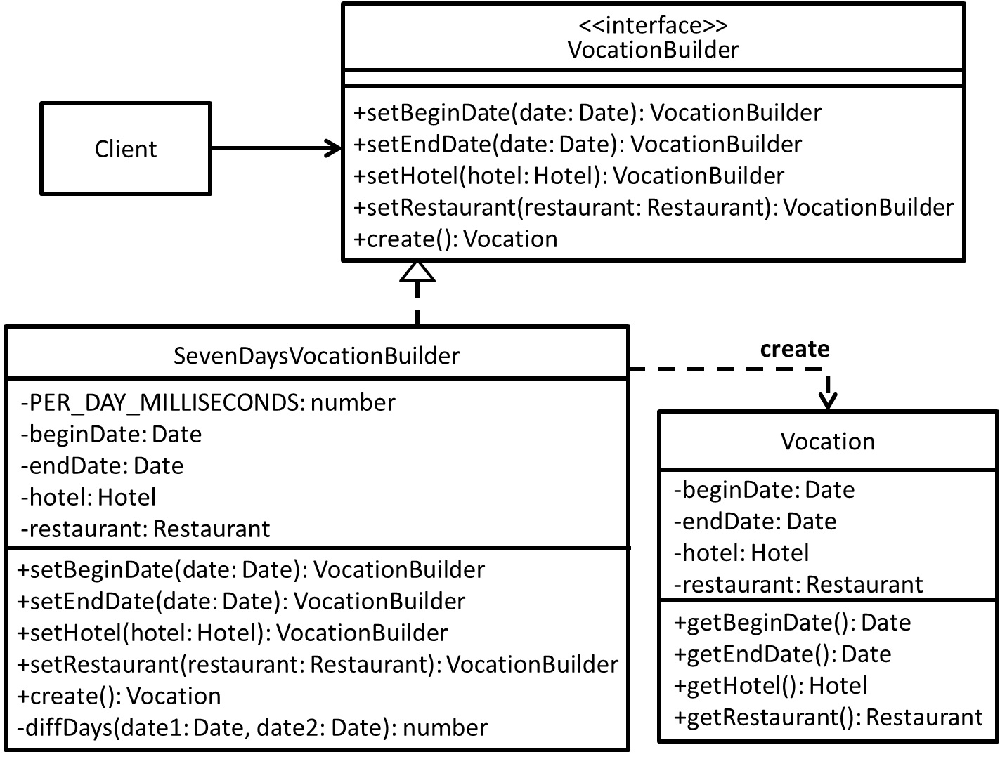
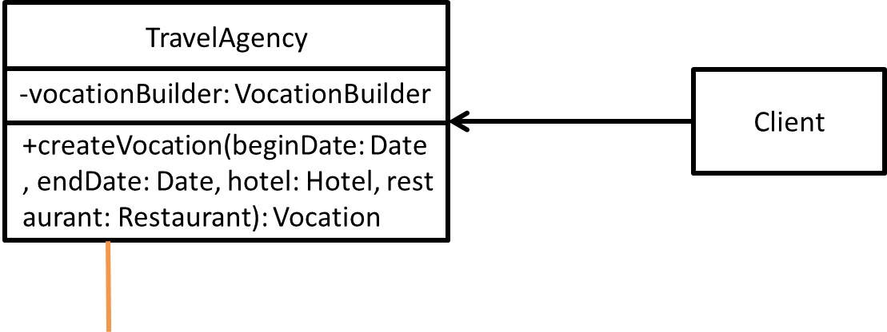
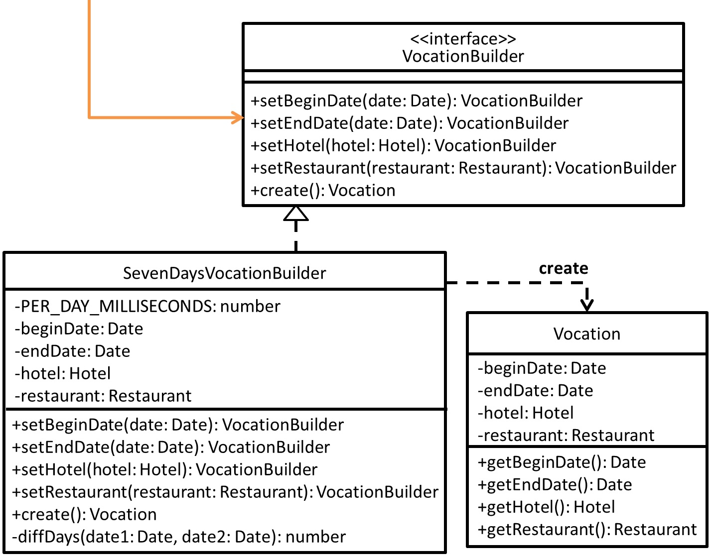

# Builder - 建造者模式
## 目的
藉由將複雜物件的建構及樣貌分離，以達成用同樣的建構方式創造不同樣貌的物件。

## 舉例
以旅行社幫客戶規劃假期為例子，光是這個假期需要的資訊就不少(可能包含這個假期什麼時候開始？什麼時候結束？要訂哪家旅館？要吃哪些餐廳？)，同樣都是假期，卻會因為客戶的需求而有不同的樣貌。

## 思考方向？
在設計方面可能一開始會考量針對假期物件擁有多個建構子來應付客戶需求，但還是有可能建構子沒辦法全部符合客戶需求，所以勢必要用比較彈性的方式讓客戶端能簡單取得想要的假期物件。

## 類別圖
### 簡化

### 嚴謹



## 值得注意什麼？
- 將整個複雜物件的產生過程封裝起來，讓客戶端不能影響物件建立的步驟(物件建立這件事對客戶端是隱藏的)。
- 對於客戶端而言，允許用多個步驟來建立物件，但要是不知道有哪些方法可以用，也無法建立出想要的物件。
- 對其下生成的複雜物件之間會有部分(is-part-of)關係，意指藉由多個部分才算一個整體(假期中沒有旅館可能就怪怪的)。
- Director 實際扮演的角色為指揮 Builder 該如何建構物件，但多數實務上會把 Director 省略掉，讓客戶端直接控制其建構步驟。

## 測試
```
$ npm run test Builder
```

## 參考文章
 - [建立者模式 (Builder Pattern)](http://corrupt003-design-pattern.blogspot.com/2017/01/builder-pattern.html)
 - [Java 設計模式 建造者模式 Builder Pattern](https://matthung0807.blogspot.com/2019/09/design-pattern-builder-pattern.html)
 - [白話 Design Pattern (四) Builder pattern](http://rockssdlog.blogspot.com/2012/05/design-pattern-builder-pattern.html)