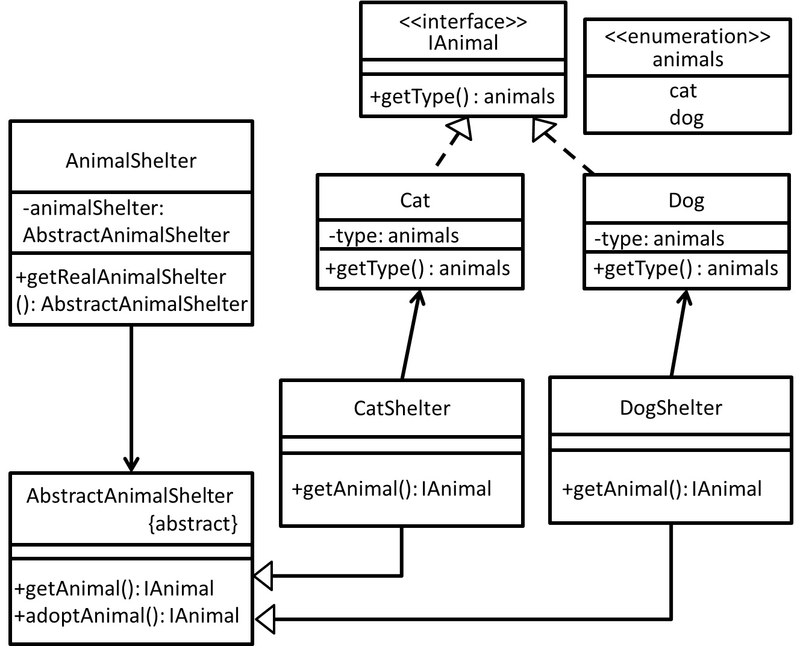

# Factory Method - 工廠方法模式 
## 目的
保有簡單工廠優點，把工廠抽象化並且把創造物件這件事**延遲到子類別決定**。

## 舉例
若以**動物收容所**為例子，我很想**領養動物**，但其實我**並不是很在意是貓或者是狗**。

(補充例子)  
若以**開啟資料庫連線**為例子，然而我**並不是很在意開啟連線的是Oracle還是MsSqlServer(以資料存取來說)**，因為我**只需要開啟資料庫連線這件事**。

## 類別圖


## 值得注意什麼？
### 優點
- 維持開放封閉原則(OCP) - 若要新增動物收容所，依據工廠介面寫新實作就可以。
- 將工廠(動物收容所)抽象化，對於狗和貓的照顧流程(實作內容)可有不同，不會有相互影響的情況。
- 想完成某件事情，但是我不必在意裡面怎麼實作的，能達到我預期的效果就好。
- 推遲實例化時間至子類別決定，而不是工廠類別本身決定。
### 缺點
- 若要新增動物收容所，相對也要實作出動物(成對出現)。
- 只能創造一個子類別物件，但倘若其子類別物件還有其物件相依關係(例如貓要穿上貓衣服，貓衣服和貓就有隱含抽象關係，假設我們一定要讓貓穿上貓衣服的話)，為此我們也會需要建立一個貓衣服工廠。

## 測試
```
$ npm run test FactoryMethod
```

## 參考文章
 - [工廠模式 Factory Pattern](https://skyyen999.gitbooks.io/-study-design-pattern-in-java/content/factory.html)
 - [設計模式 - 工廠方法及抽象工廠](https://blog.techbridge.cc/2017/05/22/factory-method-and-abstract-factory/)
