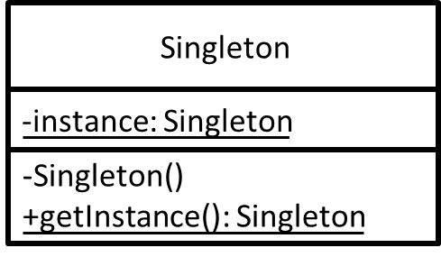

# Singleton - 獨體模式
## 目的
確保這個類別只能生成一個實例(即便是在多執行緒下也是如此)，讓其可以被全域存取。

## 舉例
站在節省資源的角度來看，這個實例我只希望被 new 一次就好，因為它如果只是要單純做資料轉換...等等很單純的工作。  
站在邏輯計算的角度來看，我需要讓經過其實例的結果不要受到太多像是多執行緒可能會造成的影響...等等。

## 類別圖


## 值得注意什麼？
- 獨體模式在不同程式語言實作時，需要特別注意多執行緒及同步問題，避免不必要的資源消耗，嚴重甚至有可能會導致死結發生。

## 測試
```
$ npm run test Singleton
```

## 參考文章
 - [獨體模式 (Singleton Pattern)](http://corrupt003-design-pattern.blogspot.com/2016/06/singleton-pattern.html)
 - [Singleton in TypeScript](https://refactoring.guru/design-patterns/singleton/typescript/example)
