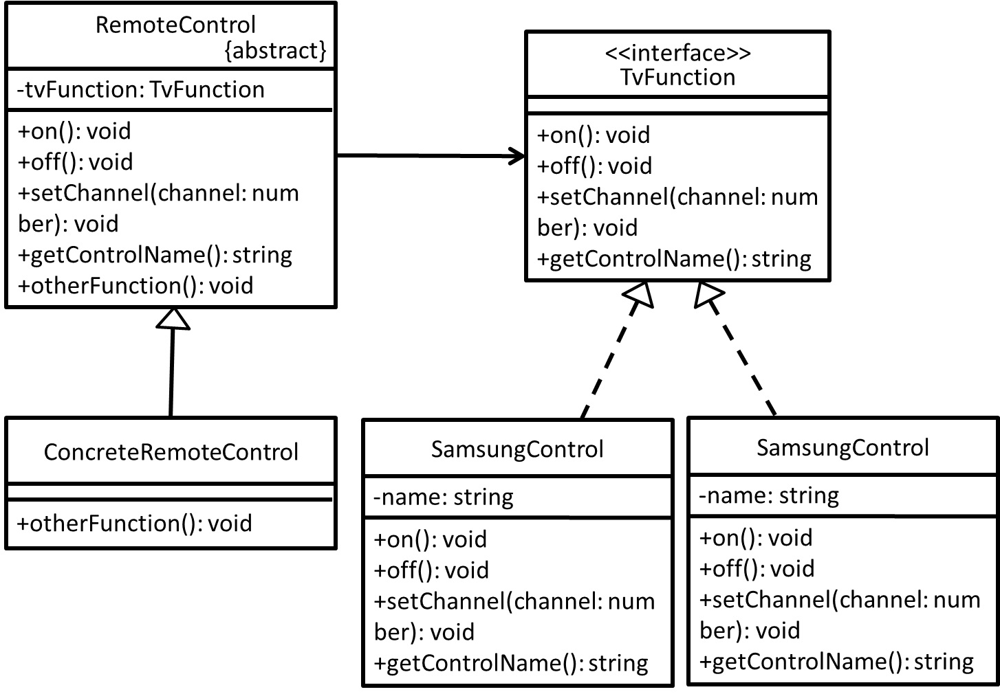

# Bridge - 橋接模式
## 目的
主要將抽象及實作分開，使之能個別獨立且不互相干擾。

## 舉例
以遙控器為例子，我想做一支可以控制 Sony 及 Samsung 電視的遙控器，但各家廠商都有各自的 API 實作(on, off, setChannel...)，我想容納他們已寫好的功能以及我需要自己寫額外擴充功能，兩者對於功能實作上要能並進又不能互相干擾，或許**橋接模式**就能派上用場！

## 類別圖


## 值得注意什麼？
- 將**實作跟介面鬆綁**(仔細觀察 ConcreteRemoteControl 實作 on, off, setChannel...等方法，其實方法命名上可有不同，意指方法名稱並不會依賴在 TvFunction 介面，因為我並不在意其它各自廠商如何去實作這些方法，能用就好...)。
- 抽象跟實作可以**各自擴充**，不影響雙方。
- 具體的抽象類別(ConcreteRemoteControl)實作，不會影響 Sony(SonyControl) 及 Samsung(SamsungControl) 各自的實作。

## 測試
```
$ npm run test Bridge
```

## 參考文章
 - [橋接模式 (Bridge Pattern)](http://corrupt003-design-pattern.blogspot.com/2017/01/bridge-pattern.html)
 - [你的東西就是我的東西！ - 橋接模式 ( Bridge Pattern )](https://ithelp.ithome.com.tw/articles/10207956?sc=iThelpR)