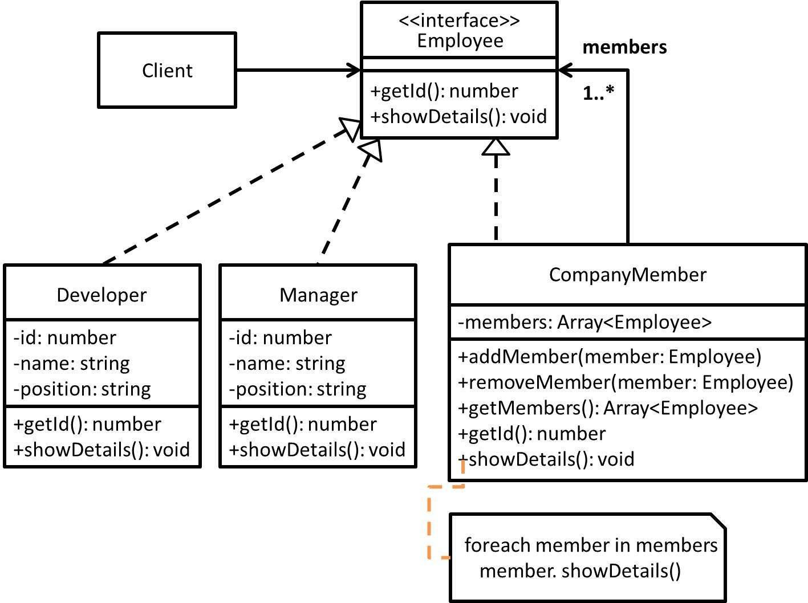

# Composite - 合成模式
## 目的
透過將物件合成為樹狀結構，以呈現「部份/整體」的階層關係。合成能讓客戶端以一致的方式處理**個別物件(Leaf)**以及**合成的物件(Composite)**。

## 舉例
以公司成員為例子，假設我們今天以比較單純的方式來看經理及程式設計師這兩個角色，就各自為一小圈圈，但其實兩者多數情況下差異並不大，因為皆是公司成員。

## 類別圖


## 值得注意什麼？
- 一般來說在**處理樹狀結構**，開發人員**需要去區分葉節點及分支，導致在實作上會複雜許多且容易出狀況**，所以**藉由介面(interface)去統一處理葉節點及分支是個不錯的方式，可以降低外部操作的複雜程度**。
- 在物件導向程式所提到之「合成」，通常均指一或多個相似物件的合成，前面提到相似物件也代表均有相似功能，這也是大家所熟知物件之間的「具有(has-a)」關係。
- 透過該模式勢必可以減少需要建立物件的數量(因為已漸漸被合成掉)，自然而然降低記憶體使用狀況。
- 如果客戶端**不是很在意其個別物件及合成物件之間的差異性，可以參考此模式，反之則不建議使用此模式**。

## 測試
```
$ npm run test Composite
```

## 參考文章
 - [合成模式 (Composite Pattern)](http://corrupt003-design-pattern.blogspot.com/2016/08/composite-pattern.html)
 - [Composite Design Pattern](https://www.geeksforgeeks.org/composite-design-pattern/)
 - [\[Design Pattern\]組合模式(Composite pattern)](https://dotblogs.com.tw/ricochen/2012/08/08/73906)