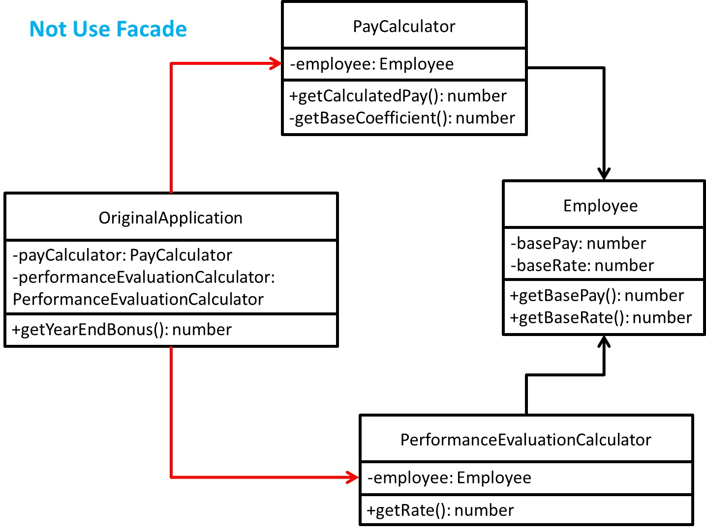
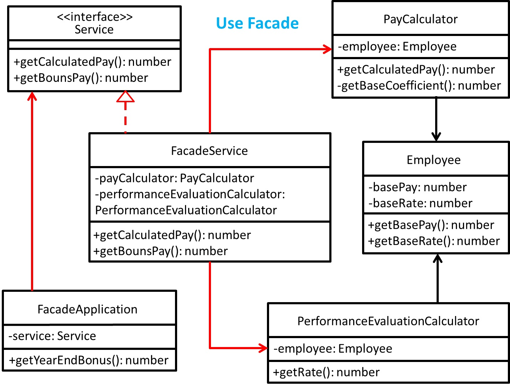

# Facade - 外觀模式
## 目的
可以將一或多個複雜的次系統，變得容易使用，提供更合理的介面，來簡化原先的次系統們的複雜介面。

## 舉例
以計算員工年終獎金為例子，將計算薪資及績效獎金兩件事分開。

## 類別圖

---


## 值得注意什麼？
- 假設需要很多**子系統互動**來完成一件事，可以參考此模式。
- 提供一個**統一介面**，給予外部呼叫，而外部不需要知道裡面如何實作(降低耦合)，但要知道如何使用。
- 可以以較簡單的方式就能使用底下子系統。

## 測試
```
$ npm run test Facade
```

## 參考文章
 - [外觀模式 Facade Pattern](https://dotblogs.com.tw/jesperlai/2018/04/15/153646)
