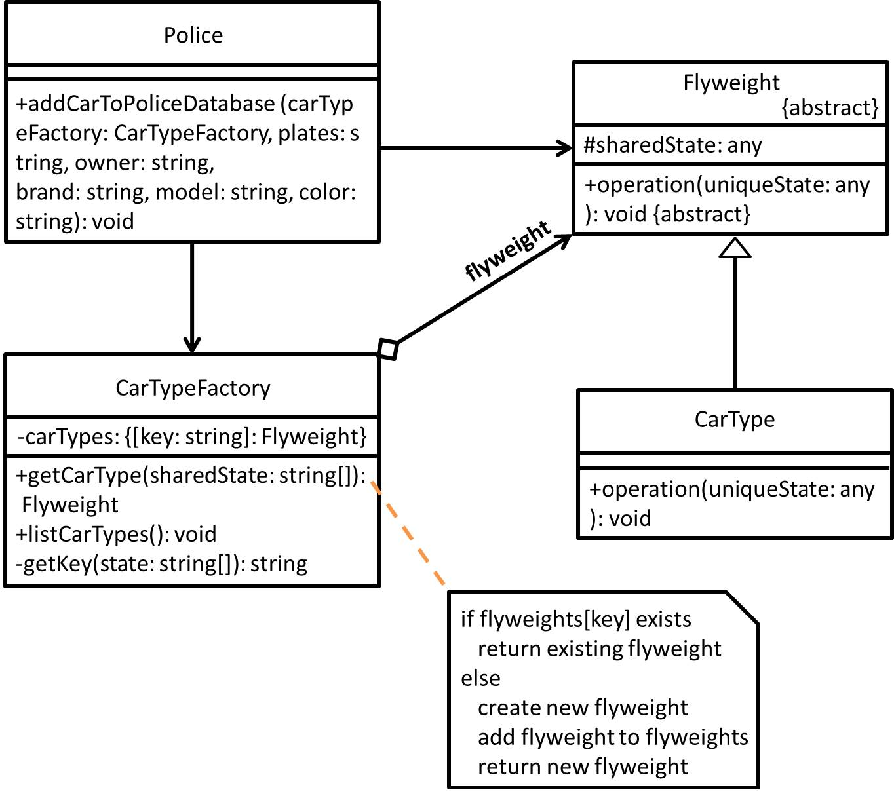

# Flyweight - 享元模式
## 目的
盡可能減少記憶體使用量以及**分享資訊(不是將資訊保留於物件上)**給盡可能多的相似物件。

## 舉例
- 現實世界可能像是警察在做筆錄，需要將車主的一些資訊 Key 進資料庫，而這些資訊其中像是**車商、型號、顏色可能為可共享的狀態(固有狀態，因為就變化不大)**，但是**車主名字、車牌號碼基本上就很容易變動(屬於非固有狀態)**。
- 假如我要在一張畫布上渲染多棵樹，從中可以得知**樹的名稱、顏色、質地可能為可共享的狀態(固有狀態)**，但在**畫布上的位置(非固有狀態)**則會有所不同。

## 類別圖


## 值得注意什麼？
- 如果發現程式會因為創建太多相似物件，而導致 RAM 被消耗殆盡，**才建議**使用此模式。
- 大量相似物件內的狀態多有重複情形，也會建議將其狀態視為可共享的。
- 程式碼會相對複雜許多，因為將**狀態本身**區分為**固有狀態**及**非固有狀態(外在狀態)**。

## 測試
```
$ npm run test Flyweight
```

## 參考文章
 - [Flyweight](https://refactoring.guru/design-patterns/flyweight)
 - [享元模式 (Flyweight Pattern)](http://corrupt003-design-pattern.blogspot.com/2017/01/flyweight-pattern.html)